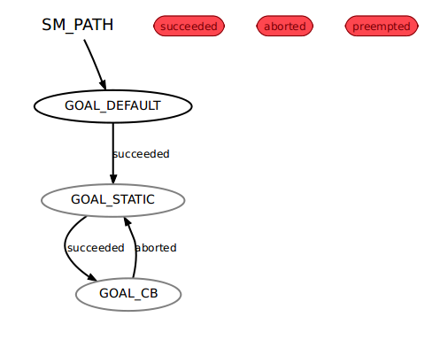

# <p align="left"> ROS SMACH 基础教程(一)  </p>
## 1.SMACH介绍
当机器人在执行一些复杂的计划时，SMACH将变得很有用，它可以将可能的状态和状态状态转移过程简化，将不同的任务模块整合到一起，让机器人实现复杂的任务调度。

- 适合用SMACH的情况
	+ 快速原型化：基于Python的简单SMACH语法使快速原型化状态机并开始运行状态机变得容易。
	- 复杂状态机：SMACH允许您设计、维护和调试大型复杂的分层状态机。你可以在这里找到一个复杂的分层状态机的例子。
	- 内省： SMACH让你充分内省状态机、状态转换和数据流等。查看smach_viewer获得更多细节。
- 不适合使用状态机
    - 非结构化的任务： 对于你的非结构化任务，SMACH将调度不足。
    - 低级系统: 对于要求高效率的低级系统，SMACH并不意味着可以作为一个状态机使用，SMACH是一个任务级体系。
    - Smash: 当你想要使用smash的时候，不要使用SMACH，这时候使用smash.
    
 可以使用SMACH构建有限状态机，但SMACH可以做更多的事情。SMACH是一个用于任务级执行和协调的库，并提供了几种类型的“状态容器”。其中一个容器是有限状态机，但这个容器也可以是另一个容器中的状态。有关SMACH中内置的容器和状态的列表，请参见[教程](http://wiki.ros.org/smach/#About_SMACH)页面。
 
 
## 2.SMACH文档
### 2.1 概念
### 2.1.1 结果语义

对于所有SMACH容器，所包含状态的接口是通过状态结果定义的。状态的潜在结果是状态实例的属性，必须在执行之前声明。如果手工编写SMACH计划，则在构建时声明所有可能的结果，并且可以轻松地检查状态转换的一致性，而无需执行它。

状态结果可能会导致不同类型的容器发生不同的事情，但从状态的角度来看，结果发出后发生的事情是无关紧要的。从这个意义上说，结果可以被认为是特定状态的“局部”。

例如，状态可能提供“成功”、“中止”或“抢占”等结果，就状态而言，这是它与任务级状态流交互的方式。在状态机的上下文中，这些结果将与其他状态相关联，从而形成转换。但是，在另一个容器的上下文中，它们可能被区别对待。结果只是作为状态和容器之间的公共接口。

### 2.1.2 用户数据
每个 SMACH 容器都有一个平面数据库，用于在不同状态之间协调和传递数据。当状态计算一些结果或返回一些传感器信息时，这变得很有用。这允许将此类数据保存在执行级别，并可供其他任务或过程使用。

与结果类似，在每个状态中设置和检索的用户数据键由状态的**输入键**和**输出键**描述。这些也是状态实例的属性，必须在执行之前声明。当 SMACH 计划变得复杂时，所有这些交互的声明可以防止错误并有助于调试。

有关用户数据 API 的信息，请参阅[在 SMACH 中操作](http://wiki.ros.org/smach/Tutorials/User%20Data)用户数据。

### 2.1.3 抢占
抢占传播内置于 SMACH 中。State基类包括一个用于协调容器和包含状态之间的抢占请求的接口。每种容器类型都有自己明确定义的行为来响应抢占请求。这使得系统既可以干净地响应来自最终用户的终止信号，又可以由更高级别的执行人员以编程方式取消。

### 2.1.4 内省
SMACH 容器可以提供调试接口，允许开发人员（通过 ROS）设置 SMACH 树的完整初始状态。这可以通过[SMACH Viewer](http://wiki.ros.org/smach_viewer)进行可视化。这包括每个容器的初始状态标签以及每个级别的用户数据结构的内容。

## 2.2 状态
“状态”在不同的上下文中可能意味着不同的事物。在 SMACH 中，“状态”是执行的本地状态，或者等效地，“状态”对应于执行某些任务的系统。这与正式的状态机不同，其中每个状态描述的不是系统正在做什么，而是描述系统的给定配置。这允许用户专注于系统正在执行的内容以及所述执行的结果，而不是命名执行之间的点。SMACH 中的状态更多地对应于结构化编程中的状态。有关此区别的更多信息，以及如何在 SMACH 中可视化状态，请参阅状态图 VS 流程图。

### 2.2.1 提供的状态类

类|描述|结果
---|:--:|---:
状态|状态基接口|没有
SPA状态|具有三个常用预定义结果的状态 |成功，抢占，中止
[监控状态](http://docs.ros.org/en/groovy/api/smach_ros/html/python/smach_ros.monitor_state.MonitorState-class.html)|订阅 ROS 主题并在条件成立时阻塞的状态。 |有效的，无效的，被抢占的
[条件状态](http://docs.ros.org/en/groovy/api/smach_ros/html/python/smach_ros.condition_state.ConditionState-class.html)|执行条件回调的状态 |真假_ _
[简单动作状态](http://docs.ros.org/en/groovy/api/smach_ros/html/python/smach_ros.simple_action_state.SimpleActionState-class.html)|充当简单actionlib操作的代理的状态 |成功，抢占，中止


## 2.3.容器
SMACH 库提供了几种容器类型。不同的容器提供不同的执行语义，但它们都可以被视为其他容器中的状态。容器可能有自己的方式来指定包含状态的转换，因为“转换”在不同的上下文中意味着不同的东西。

所有 SMACH 容器都具有以下属性：

- 它们包含一个状态字典，其中实现 smach.State 接口的对象由字符串标签作为键。
- 它们包含一个所有孩子都可以访问的用户数据结构。
- 为了修改容器的结构，必须打开它（见下文）。

### 2.3.1 打开容器进行施工
这可以通过使用 Python 的**with**关键字或通过在容器对象上调用**open()**和**close()**来完成。with关键字可以与容器对象本身一起使用，也可以在容器的打开方法上使用。

### 2.3.2 向容器添加状态
SMACH 容器提供添加子项的静态方法。这些方法访问当前打开的容器并相应地添加状态。

### 2.3.3提供的容器类
- [状态机](http://docs.ros.org/en/groovy/api/smach/html/python/smach.state_machine.StateMachine-class.html)
- [并发](http://docs.ros.org/en/groovy/api/smach/html/python/smach.concurrence.Concurrence-class.html)
- [顺序](http://docs.ros.org/en/groovy/api/smach/html/python/smach.sequence.Sequence-class.html)
- [迭代器](http://docs.ros.org/en/groovy/api/smach/html/python/smach.iterator.Iterator-class.html)


## 3. 在各个状态传递数据
**说明：** 本教程教您如何将数据从一个状态传递到下一个状态
**教程级别：**初学者

## 3.1.指定用户数据
一个状态可能需要一些**输入数据**来完成它的工作，并且/或者它可能有一些**输出数据**想要提供给其他状态。状态的输入和输出数据称为该状态的用户数据。在构造状态时，可以指定它需要/提供的用户数据字段的名称。
```
class Foo(smach.State):
	def __init__(self, outcomes=['outcome1', 'outcome2'],
					     input_keys=['foo_input'],
					     output_keys=['foo_output'])
	def execute(self, userdata):
		if userdata.foo_inout == 1:
			return 'outcom1'
		else :
			userdata.foo_output = 3
			return 'outcom2'				 
```

-  input_keys列表枚举一个状态需要运行的所有输入。状态声明它希望这些字段存在于用户数据中。执行方法提供了用户数据结构的副本。状态可以读取它在input_keys列表中枚举的所有userdata字段，但它不能写入这些字段中的任何一个。
- output_keys列表枚举一个状态提供的所有输出。状态可以写入output_keys列表中枚举的userdata结构中的所有字段。

**注意:**通过input_keys从userdata获取的对象被封装为不可变性，因此状态不能调用这些对象上的方法。如果您需要一个可变的输入对象，您必须在input_keys和output_keys中指定相同的键。如果不传递对象，或者不需要调用或修改它们的方法，则应该在input_keys和output_keys中使用唯一的名称，以避免混淆和潜在的bug。
 
状态的接口由其结果、输入键和输出键定义。

## 3.2.连接用户数据

在向状态机添加状态时，还需要连接用户数据字段，以允许状态之间传递数据。例如，如果状态FOO产生'foo_output'，而状态BAR需要'bar_input'，那么你可以使用名称重映射将这两个用户数据端口连接在一起:

```
sm_top = smach.StateMachine(outcomes=['outcome4','outcome5'],
								input_keys=['sm_input'],
								output_keys=['sm_output'])
with sm_top:
	smach.StateMachine.add('FOO',Foo(),
								transitions={'outcome1':'BAR',
											  'outcome2':'outcome4'},
								remapping={'foo_input':'sm_data',
											'foo_output':'sm_data'}
	)
	smach.StateMachine.add('BAR',Bar(),
								transitions={'outcome2',:'FOO'},
								remapping={'bar_input':'sm_data',
											'bar_output1':'sm_output'})

```

重映射字段将状态的in/output_key映射到状态机的userdata字段。所以当你重新映射'x':'y'时:

- X需要是状态的input_key或output_key，并且

- Y将自动成为状态机的用户数据的一部分。

**注意:**当你的状态中使用的用户数据名与状态机中使用的用户数据名相同时，不需要重新映射。然而，重映射使得连接非常显式，所以建议总是指定重映射，甚至像“重映射={'a':'a'}”这样的东西。

### 3.2.1在状态之间传递数据

我们可以使用重映射机制将数据从状态FOO传递到状态BAR。为了实现这一点，我们在添加FOO时需要一个重映射，在添加BAR时需要一个重映射:

- FOO:remapping={'foo_output':'sm_user_data'}

- BAR:remapping={'bar_input':'sm_user_data'}

### 3.2.2 在状态机和状态之间传递数据

我们还可以使用重映射机制将数据从状态BAR传递到包含BAR的状态机。如果'sm_output'是状态机的输出键:

- BAR:remapping={'bar_input':'sm_output'}

或者，相反，我们可以将数据从状态机传递到状态FOO。如果'sm_input'是状态机的输入键:

- FOO:remapping={'foo_output':'sm_input'}


## 3.3举例
```
#!/usr/bin/env python

import roslib; roslib.load_manifest('smach_tutorials')
import rospy
import smach
import smach_ros

# define state Foo
class Foo(smach.State):
    def __init__(self):
        smach.State.__init__(self, 
                             outcomes=['outcome1','outcome2'],
                             input_keys=['foo_counter_in'],
                             output_keys=['foo_counter_out'])

    def execute(self, userdata):
        rospy.loginfo('Executing state FOO')
        if userdata.foo_counter_in < 3:
            userdata.foo_counter_out = userdata.foo_counter_in + 1
            return 'outcome1'
        else:
            return 'outcome2'


# define state Bar
class Bar(smach.State):
    def __init__(self):
        smach.State.__init__(self, 
                             outcomes=['outcome1'],
                             input_keys=['bar_counter_in'])
        
    def execute(self, userdata):
        rospy.loginfo('Executing state BAR')
        rospy.loginfo('Counter = %f'%userdata.bar_counter_in)        
        return 'outcome1'
        

def main():
    rospy.init_node('smach_example_state_machine')

    # Create a SMACH state machine
    sm = smach.StateMachine(outcomes=['outcome4'])
    sm.userdata.sm_counter = 0

    # Open the container
    with sm:
        # Add states to the container
        smach.StateMachine.add('FOO', Foo(), 
                               transitions={'outcome1':'BAR', 
                                            'outcome2':'outcome4'},
                               remapping={'foo_counter_in':'sm_counter', 
                                          'foo_counter_out':'sm_counter'})
        smach.StateMachine.add('BAR', Bar(), 
                               transitions={'outcome1':'FOO'},
                               remapping={'bar_counter_in':'sm_counter'})

    # Execute SMACH plan
    outcome = sm.execute()

if __name__ == '__main__':
    main()
```

程序输出结果：
```
[INFO] [1647916956.000118]: State machine starting in initial state 'FOO' with userdata: 
	['sm_counter']
[INFO] [1647916956.000779]: Executing state FOO
[INFO] [1647916956.001367]: State machine transitioning 'FOO':'outcome1'-->'BAR'
[INFO] [1647916956.001626]: Executing state BAR
[INFO] [1647916956.001883]: Counter = 1.000000
[INFO] [1647916956.002094]: State machine transitioning 'BAR':'outcome1'-->'FOO'
[INFO] [1647916956.002342]: Executing state FOO
[INFO] [1647916956.002581]: State machine transitioning 'FOO':'outcome1'-->'BAR'
[INFO] [1647916956.002834]: Executing state BAR
[INFO] [1647916956.003061]: Counter = 2.000000
[INFO] [1647916956.003278]: State machine transitioning 'BAR':'outcome1'-->'FOO'
[INFO] [1647916956.003500]: Executing state FOO
[INFO] [1647916956.003763]: State machine transitioning 'FOO':'outcome1'-->'BAR'
[INFO] [1647916956.003992]: Executing state BAR
[INFO] [1647916956.004216]: Counter = 3.000000
[INFO] [1647916956.004484]: State machine transitioning 'BAR':'outcome1'-->'FOO'
[INFO] [1647916956.004727]: Executing state FOO
[INFO] [1647916956.004958]: State machine terminating 'FOO':'outcome2':'outcome4'

```

## 4.创建分级状态机
## 4.1. 创建一些状态
对于本例，我们创建了许多状态，每个状态都指定了许多结果、输入键和输出键。
```
  # State Foo
  class Foo(smach.State):
     def __init__(self, outcomes=['outcome1', 'outcome2'])
     
     def execute(self, userdata):
        return 'outcome1'


  # State Bar
  class Bar(smach.State):
     def __init__(self, outcomes=['outcome1'])
     
     def execute(self, userdata):
        return 'outcome4'


  # State Bas
  class Bas(smach.State):
     def __init__(self, outcomes=['outcome3'])
     
     def execute(self, userdata):
        return 'outcome3'
```

## 4.2.创建分层状态机
我们创建一个顶级状态机，并开始向它添加状态。我们添加的一个状态是另一个状态机:
```
   # Create the top level SMACH state machine
    sm_top = smach.StateMachine(outcomes=['outcome5'])

    # Open the container
    with sm_top:

        smach.StateMachine.add('BAS', Bas(),
                               transitions={'outcome3':'SUB'})

        # Create the sub SMACH state machine 
        sm_sub = smach.StateMachine(outcomes=['outcome4'])

        # Open the container 
        with sm_sub:

            # Add states to the container 
            smach.StateMachine.add('FOO', Foo(),
                                   transitions={'outcome1':'BAR', 
                                                'outcome2':'outcome4'})
            smach.StateMachine.add('BAR', Bar(),
                                   transitions={'outcome1':'FOO'})

        smach.StateMachine.add('SUB', sm_sub,
                               transitions={'outcome4':'outcome5'})
```

结果是这样的。唯一需要注意的一点是，每个状态机也是一个正常状态。因此，可以将状态机添加到另一个状态机，方法与将状态添加到状态机相同。因此，处理userdata与处理分层状态机没有什么不同:子状态机指定输入和输出键，当将子状态机添加到顶级状态机时，它们会被映射。


## 4.3.举例
```
#!/usr/bin/env python

import roslib; roslib.load_manifest('smach_tutorials')
import rospy
import smach
import smach_ros

# define state Foo
class Foo(smach.State):
    def __init__(self):
        smach.State.__init__(self, outcomes=['outcome1','outcome2'])
        self.counter = 0

    def execute(self, userdata):
        rospy.loginfo('Executing state FOO')
        if self.counter < 3:
            self.counter += 1
            return 'outcome1'
        else:
            return 'outcome2'


# define state Bar
class Bar(smach.State):
    def __init__(self):
        smach.State.__init__(self, outcomes=['outcome1'])

    def execute(self, userdata):
        rospy.loginfo('Executing state BAR')
        return 'outcome1'
        


# define state Bas
class Bas(smach.State):
    def __init__(self):
        smach.State.__init__(self, outcomes=['outcome3'])

    def execute(self, userdata):
        rospy.loginfo('Executing state BAS')
        return 'outcome3'


def main():
    rospy.init_node('smach_example_state_machine')

    # Create the top level SMACH state machine
    sm_top = smach.StateMachine(outcomes=['outcome5'])
    
    # Open the container
    with sm_top:

        smach.StateMachine.add('BAS', Bas(),
                               transitions={'outcome3':'SUB'})

        # Create the sub SMACH state machine
        sm_sub = smach.StateMachine(outcomes=['outcome4'])

        # Open the container
        with sm_sub:

            # Add states to the container
            smach.StateMachine.add('FOO', Foo(), 
                                   transitions={'outcome1':'BAR', 
                                                'outcome2':'outcome4'})
            smach.StateMachine.add('BAR', Bar(), 
                                   transitions={'outcome1':'FOO'})

        smach.StateMachine.add('SUB', sm_sub,
                               transitions={'outcome4':'outcome5'})

    # Execute SMACH plan
    outcome = sm_top.execute()


if __name__ == '__main__':
    main()
```

程序输出结果：
```
[INFO] [1647918547.471406]: State machine starting in initial state 'BAS' with userdata: 
	[]
[INFO] [1647918547.471781]: Executing state BAS
[INFO] [1647918547.472021]: State machine transitioning 'BAS':'outcome3'-->'SUB'
[INFO] [1647918547.472292]: State machine starting in initial state 'FOO' with userdata: 
	[]
[INFO] [1647918547.472532]: Executing state FOO
[INFO] [1647918547.472776]: State machine transitioning 'FOO':'outcome1'-->'BAR'
[INFO] [1647918547.473022]: Executing state BAR
[INFO] [1647918547.473253]: State machine transitioning 'BAR':'outcome1'-->'FOO'
[INFO] [1647918547.473495]: Executing state FOO
[INFO] [1647918547.473755]: State machine transitioning 'FOO':'outcome1'-->'BAR'
[INFO] [1647918547.473993]: Executing state BAR
[INFO] [1647918547.474448]: State machine transitioning 'BAR':'outcome1'-->'FOO'
[INFO] [1647918547.474715]: Executing state FOO
[INFO] [1647918547.474946]: State machine transitioning 'FOO':'outcome1'-->'BAR'
[INFO] [1647918547.475181]: Executing state BAR
[INFO] [1647918547.475405]: State machine transitioning 'BAR':'outcome1'-->'FOO'
[INFO] [1647918547.475659]: Executing state FOO
[INFO] [1647918547.475886]: State machine terminating 'FOO':'outcome2':'outcome4'
[INFO] [1647918547.476117]: State machine terminating 'SUB':'outcome4':'outcome5'

```

## 5.从状态机(ROS)调用操作
```
from smach_ros import SimpleActionState
```
您可以简单地从通用状态调用任何操作，但是SMACH对调用操作有特定的支持，从而节省了大量代码!SMACH提供了一个状态类，它充当actionlib操作的代理。状态的实例化接受一个主题名称、动作类型和一些用于生成目标的策略。简单动作状态的可能结果是“成功”、“被抢占”和“中止”。

根据你如何实现你的目标，有简单的和更复杂的方法来使用简单的动作状态。

## 5.1. 目标消息
### 5.1.1 空目标消息
这是一个简单的例子，它将调用一个动作服务器，而不需要在目标消息中填写任何内容。
```
sm = StateMachine(['succeeded','aborted','preempted'])
with sm:
    smach.StateMachine.add('TRIGGER_GRIPPER',
                           SimpleActionState('action_server_namespace',
                                             GripperAction),
                           transitions={'succeeded':'APPROACH_PLUG'})
```

### 5.1.2 固定目标消息
一个稍微高级一点的用法是，让你指定一个硬编码的固定目标，它将被传递给动作服务器:
```
sm = StateMachine(['succeeded','aborted','preempted'])
with sm:
    gripper_goal = Pr2GripperCommandGoal()
    gripper_goal.command.position = 0.07
    gripper_goal.command.max_effort = 99999
    StateMachine.add('TRIGGER_GRIPPER',
                      SimpleActionState('action_server_namespace',
                                        GripperAction,
                                        goal=gripper_goal),
                      transitions={'succeeded':'APPROACH_PLUG'})
```

### 5.1.3 来自用户的目标
假设用户数据中有许多字段已经包含目标消息所需的所有结构。然后，您可以简单地将userdata直接连接到目标消息中的字段。因此，从上面的例子中我们知道，抓手动作的目标中有两个字段:max_effort和position。假设我们的userdata包含相应的字段user_data_max和user_data_position。下面的代码连接了相应的字段。
```
sm = StateMachine(['succeeded','aborted','preempted'])
with sm:
    StateMachine.add('TRIGGER_GRIPPER',
                      SimpleActionState('action_server_namespace',
                                        GripperAction,
                                        goal_slots=['max_effort', 
                                                    'position']),
                      transitions={'succeeded':'APPROACH_PLUG'},
                      remapping={'max_effort':'user_data_max',
                                 'position':'user_data_position'})
```
同样的工作对于'result_slots':操作的结果字段可以自动写入您的用户数据。还要注意的是，你在'goal_slots'和'result_slots'中指定的所有字段都会自动放到'input_keys'和'output_keys'中。

#### 5.1.4 目标回调
这是终极的力量版本:当动作需要目标时，你可以得到一个回调，你也可以根据需要创建自己的目标消息。
```
sm = StateMachine(['succeeded','aborted','preempted'])
with sm:
    def gripper_goal_cb(userdata, goal):
       gripper_goal = GripperGoal()
       gripper_goal.position.x = 2.0
       gripper_goal.max_effort = userdata.gripper_input
       return gripper_goal

    StateMachine.add('TRIGGER_GRIPPER',
                      SimpleActionState('action_server_namespace',
                                        GripperAction,
                                        goal_cb=gripper_goal_cb,
                                        input_keys=['gripper_input'])
                      transitions={'succeeded':'APPROACH_PLUG'},
                      remapping={'gripper_input':'userdata_input'})
```
在你的目标回调中，你可以使用userdata，只要你在构造函数中列出了input_keys。回调函数的一个参数是默认目标。如果你指定了'goal=…'，该对象将被传递到回调函数中。

要了解更高级的回调用法，请参见[cb_interface](http://docs.ros.org/en/jade/api/smach/html/python/smach.util.CBInterface-class.html)(来自ROS Jade的API)装饰器。

## 5.2.结果消息
### 5.2.1 用户结果消息
您可以将操作的结果直接写入您的状态的用户数据。
```
sm = StateMachine(['succeeded','aborted','preempted'])
with sm:
    StateMachine.add('TRIGGER_GRIPPER',
                      SimpleActionState('action_server_namespace',
                                        GripperAction,
                                        result_slots=['max_effort', 
                                                      'position']),
                      transitions={'succeeded':'APPROACH_PLUG'},
                      remapping={'max_effort':'user_data_max',
                                 'position':'user_data_position'})
```

### 5.2.2 用户结果回调
结果回调与目标回调非常相似。它允许您从操作结果字段读取任何数据，甚至返回一个不同于默认的'succeeded'， 'preempted'， 'aborted'的结果。
```
sm = StateMachine(['succeeded','aborted','preempted'])
with sm:
    def gripper_result_cb(userdata, status, result):
       if status == GoalStatus.SUCCEEDED:
          userdata.gripper_output = result.num_iterations
          return 'my_outcome'

    StateMachine.add('TRIGGER_GRIPPER',
                      SimpleActionState('action_server_namespace',
                                        GripperAction,
                                        result_cb=gripper_result_cb,
                                        output_keys=['gripper_output'])
                      transitions={'succeeded':'APPROACH_PLUG'},
                      remapping={'gripper_output':'userdata_output'})
```
在结果回调中，您将获得操作的状态，它告诉您操作是成功、中止还是被抢占。此外，您还可以访问用户数据以及操作的结果。

你可以选择从结果回调返回一个不同的结果。如果你不返回任何东西，状态将返回相应的动作结果。


## 6.查看状态机(ROS)
这是你想调试一个正在运行的SMACH状态机:

SMACH查看器以图形形式显示了您的(子)状态机中的所有状态、状态之间可能的转换、当前活动状态和userdata的当前值。SMACH查看器甚至允许设置状态机的初始状态。本教程将介绍如何开始使用SMACH查看器。

## 6.1.创建内省服务
SMACH容器可以提供一个调试接口(通过ROS)，允许开发人员对状态机进行全面的内省。SMACH查看器可以使用这个调试接口来可视化状态机并与状态机交互。要将这个调试接口添加到状态机中，请在代码中添加以下代码行:
```
# First you create a state machine sm
# .....
# Creating of state machine sm finished

# Create and start the introspection server
sis = smach_ros.IntrospectionServer('server_name', sm, '/SM_ROOT')
sis.start()

# Execute the state machine
outcome = sm.execute()

# Wait for ctrl-c to stop the application
rospy.spin()
sis.stop()
```

- server_name:为ROS自省主题创建名称空间。您可以随意命名这个名称，只要这个名称在您的系统中是唯一的。这个名称没有显示在smach查看器中。

- SM_ROOT:在smach查看器中，状态机将显示在这个名称下。所以你可以选择任何你喜欢的名字。如果你的子状态机在不同的可执行文件中，你可以通过一个聪明的方式选择这个名称来让它们显示为分层状态机:如果顶级状态机被称为“SM_TOP”，您可以调用子状态机“SM_TOP/SM_SUB”，查看器将识别子状态机作为顶级状态机的一部分。

有关内省服务器的更多详细信息，请参阅[API文档](https://docs.ros.org/en/api/smach_ros/html/python/smach_ros.introspection.IntrospectionServer-class.html)。

smach查看器将自动遍历sm的子容器(如果存在的话)，并为每个子容器添加ros钩子。因此，您只需要将一个内省服务器连接到顶级状态机，而不是连接到子状态机。一旦内省服务器被实例化，它将发布一组带有名称的主题，这些名称通过附加到在构造时给它的服务器名称来构造。在这种情况下，广告会宣传三个主题:

- / server_name / smach / container_structure

- / server_name / smach / container_status

- / server_name / smach / container_init

前两个是关于“server_name”提供的SMACH容器的结构和状态的心跳和事件信息。第三个是关于在ROS上设置SMACH树的配置的主题。

“SM_ROOT”参数只是用于可视化，并强制不同服务器嵌套。

## 6.2.运行SMACH查看器
一旦你在ROS系统中运行了一个或多个内省服务器，你可以使用以下命令启动smach查看器:
```
 rosrun smach_viewer smach_viewer.py
```
查看器将自动连接到所有正在运行的内省服务器。
运行结果。


## 7.并发状态机
以下所有示例无需修改即可运行。可以在示例目录中的smach_教程包中找到它们。每个文件开头的注释大致显示了运行脚本的输出应该是什么样子。


```
#!/usr/bin/env python

import roslib; roslib.load_manifest('smach_tutorials')
import rospy
import smach
import smach_ros

# define state Foo
class Foo(smach.State):
    def __init__(self):
        smach.State.__init__(self, outcomes=['outcome1','outcome2'])
        self.counter = 0

    def execute(self, userdata):
        rospy.loginfo('Executing state FOO')
        if self.counter < 3:
            self.counter += 1
            return 'outcome1'
        else:
            return 'outcome2'


# define state Bar
class Bar(smach.State):
    def __init__(self):
        smach.State.__init__(self, outcomes=['outcome1'])

    def execute(self, userdata):
        rospy.loginfo('Executing state BAR')
        return 'outcome1'
        


# define state Bas
class Bas(smach.State):
    def __init__(self):
        smach.State.__init__(self, outcomes=['outcome3'])

    def execute(self, userdata):
        rospy.loginfo('Executing state BAS')
        return 'outcome3'


def main():
    rospy.init_node('smach_example_state_machine')

    # Create the top level SMACH state machine
    sm_top = smach.StateMachine(outcomes=['outcome6'])
    
    # Open the container
    with sm_top:

        smach.StateMachine.add('BAS', Bas(),
                               transitions={'outcome3':'CON'})

        # Create the sub SMACH state machine
        sm_con = smach.Concurrence(outcomes=['outcome4','outcome5'],
                                   default_outcome='outcome4',
                                   outcome_map={'outcome5':
                                       { 'FOO':'outcome2',
                                         'BAR':'outcome1'}})

        # Open the container
        with sm_con:
            # Add states to the container
            smach.Concurrence.add('FOO', Foo())
            smach.Concurrence.add('BAR', Bar())

        smach.StateMachine.add('CON', sm_con,
                               transitions={'outcome4':'CON',
                                            'outcome5':'outcome6'})

    # Execute SMACH plan
    outcome = sm_top.execute()


if __name__ == '__main__':
    main()
```
## 8.简单动作状态（ROS）
以下所有示例无需修改即可运行。可以在示例目录中的smach_教程包中找到它们。每个文件开头的注释大致显示了运行脚本的输出应该是什么样子。

```
#!/usr/bin/env python

import roslib; roslib.load_manifest('smach_tutorials')
import rospy
import smach
import smach_ros

from smach_tutorials.msg import TestAction, TestGoal
from actionlib import *
from actionlib_msgs.msg import *


# Create a trivial action server
class TestServer:
    def __init__(self,name):
        self._sas = SimpleActionServer(name,
                TestAction,
                execute_cb=self.execute_cb)

    def execute_cb(self, msg):
        if msg.goal == 0:
            self._sas.set_succeeded()
        elif msg.goal == 1:
            self._sas.set_aborted()
        elif msg.goal == 2:
            self._sas.set_preempted()

def main():
    rospy.init_node('smach_example_actionlib')

    # Start an action server
    server = TestServer('test_action')

    # Create a SMACH state machine
    sm0 = smach.StateMachine(outcomes=['succeeded','aborted','preempted'])

    # Open the container
    with sm0:
        # Add states to the container

        # Add a simple action state. This will use an empty, default goal
        # As seen in TestServer above, an empty goal will always return with
        # GoalStatus.SUCCEEDED, causing this simple action state to return
        # the outcome 'succeeded'
        smach.StateMachine.add('GOAL_DEFAULT',
                               smach_ros.SimpleActionState('test_action', TestAction),
                               {'succeeded':'GOAL_STATIC'})

        # Add another simple action state. This will give a goal
        # that should abort the action state when it is received, so we
        # map 'aborted' for this state onto 'succeeded' for the state machine.
        smach.StateMachine.add('GOAL_STATIC',
                               smach_ros.SimpleActionState('test_action', TestAction,
                                                       goal = TestGoal(goal=1)),
                               {'aborted':'GOAL_CB'})

        
        # Add another simple action state. This will give a goal
        # that should abort the action state when it is received, so we
        # map 'aborted' for this state onto 'succeeded' for the state machine.
        def goal_callback(userdata, default_goal):
            goal = TestGoal()
            goal.goal = 2
            return goal

        smach.StateMachine.add('GOAL_CB',
                               smach_ros.SimpleActionState('test_action', TestAction,
                                                       goal_cb = goal_callback),
                               {'aborted':'succeeded'})

        # For more examples on how to set goals and process results, see 
        # executive_smach/smach_ros/tests/smach_actionlib.py

    # Execute SMACH plan
    outcome = sm0.execute()

    rospy.signal_shutdown('All done.')


if __name__ == '__main__':
    main()
```